# U-Boats

### Introduction

This exercise in data scraping and visualisation uses data scraped from [uboat.net](http://www.uboat.net/index.html) to explore aspects of the Battle of the Atantic, 1939-1945 - in particular to look at the careers of individual U-boats and U-boat commanders. This project was inspired by [Kees Duineveld's post](http://wiekvoet.blogspot.fr/2015/05/u-boats-in-ww-ii.html) on the same subject.

### Housekeeping


```r
library(dplyr)
library(lubridate)
library(ggmap)
library(ggplot2)
library(ggrepel)
library(magrittr)
library(pander)
library(rvest)
library(scales)
library(stringr)
library(tidyr)
library(XML)
```

### Gathering and Tidying the Data

Uboat.net presents its data in a variety of cross-referenced page views. The ship pages (e.g. [this one](http://uboat.net/allies/merchants/ships/1.html) for Athenia) appear to offer the easiest route to gathering a complete set of data on ships hit by u-boats. A slight complication is that some ships, e.g. [Zarian](http://uboat.net/allies/merchants/ships/2551.html) were hit more than once; in these cases, the geographic coordinates of the earlier hits are not easy to locate and are not collected here.

This function scrapes and tidies the data from the ship pages.


```r
ship.scraper <- function (ship.page) {
  
  # Scrapes data from ship pages of uboat.net and assembles selected
  # parameters into a data frame
  # Inputs:   ship.page (numeric), page to scrape
  # Outputs:  ships (data frame)

  # Read html
  url <- paste0("http://www.uboat.net/allies/merchants/ships/", ship.page, ".html")
  ship.data <- read_html(url)
  ship.data.tables <- readHTMLTable(url)
  
  # Check data exists (some pages are empty)
  if (length(ship.data.tables) != 0) {
    
    # Check for pages with Media Links
    ad.test <- ship.data %>%
    html_nodes("div:nth-child(5) h3") %>%
      extract2(1) %>%
      html_text(trim = TRUE)
    
    # Ship name
    ship <- ship.data %>%
      html_nodes("h1") %>%
      extract2(2) %>%
      html_text(trim = TRUE)
      
    # Extract first table from page
    ship.raw.1 <- data.frame(ship.data.tables[1])
    
    # Tonnage
    ship.tons <- ship.raw.1[["NULL.V2"]][2] %>%
      str_split(" ") %>%
      extract2(1) %>%
      magrittr::extract(1) %>%
      str_replace(",", "") %>%
      as.numeric()
    
    # Nationality
    ship.nat <- ship.raw.1[["NULL.V3"]][6] %>%
      str_split("Nationality:") %>%
      extract2(1) %>%
      magrittr::extract(2) %>%
      str_trim()
    
    # Coordinates
      ship.pos <- as.character(ship.raw.1[["NULL.V2"]][9])
      
      if (nchar(ship.pos) > 15) {               # if coordinates exist
        # Extract latitude degrees, minutes and hemisphere
        lat.deg <- ship.pos %>%
          str_split(",") %>%
          extract2(1) %>%
          magrittr::extract(2) %>%
          str_split("°") %>%
          extract2(1) %>%
          magrittr::extract(1) %>%
          str_trim() %>%
          as.numeric()
        lat.min <- ship.pos %>%
          str_split(",") %>%
          extract2(1) %>%
          magrittr::extract(2) %>%
          str_split("°") %>%
          extract2(1) %>%
          magrittr::extract(2) %>%
          str_split("'") %>%
          extract2(1) %>%
          magrittr::extract(1) %>%
          str_trim() %>%
          as.numeric()
        lat.hemi <- ship.pos %>%
          str_split(",") %>%
          extract2(1) %>%
          magrittr::extract(2) %>%
          str_split("°") %>%
          extract2(1) %>%
          magrittr::extract(2) %>%
          str_split("'") %>%
          extract2(1) %>%
          magrittr::extract(2) %>%
          str_split(" ") %>%
          extract2(1) %>%
          magrittr::extract(1)
        
        # Extract longitude degrees, minutes and hemisphere
        long.deg <- ship.pos %>%
          str_split(",") %>%
          extract2(1) %>%
          magrittr::extract(1) %>%
          str_split("°") %>%
          extract2(1) %>%
          magrittr::extract(1) %>%
          as.numeric()
        long.min <- ship.pos %>%
          str_split(",") %>%
          extract2(1) %>%
          magrittr::extract(1) %>%
          str_split("°") %>%
          extract2(1) %>%
          magrittr::extract(2) %>%
          str_split("'") %>%
          extract2(1) %>%
          magrittr::extract(1) %>%
          as.numeric()
        long.hemi <- ship.pos %>%
          str_split(",") %>%
          extract2(1) %>%
          magrittr::extract(1) %>%
          str_split("°") %>%
          extract2(1) %>%
          magrittr::extract(2) %>%
          str_split("'") %>%
          extract2(1) %>%
          magrittr::extract(2)
        
        # Calculate decimal latitude and longitude
        ship.lat <- ifelse(lat.hemi == "E", lat.deg + lat.min/60, -(lat.deg + lat.min/60))
        ship.long <- ifelse(long.hemi == "N", long.deg + long.min/60, -(long.deg + long.min/60))
        
        } else {
        
        ship.lat <- NA
        ship.long <- NA
        
        }
    
    if (length(ship.data.tables) > 1 & ad.test != "Media links") {
      # Ships hit on multiple occasions
      
      # Extract second table from page
      ship.raw.2 <- data.frame(ship.data.tables[2])
      
      # Define empty data frame
      ships <- data.frame(Date = as.Date(character()),
                          Ship = character(),
                          Tons = numeric(),
                          Nationality = character(),
                          U.Boat = character(),
                          Commander = character(),
                          Fate = character(),
                          Latitude = numeric(),
                          Longitude = numeric(),
                          stringsAsFactors = FALSE)
      
      for (event in 1:dim(ship.raw.2)[1]) {
        
        # Date
        ship.date <- ship.raw.2[["NULL.Date"]][event] %>%
          parse_date_time("d! b Y!")
        
        # Uboat
        ship.uboat <- ship.raw.2[["NULL.U.boat"]][event]
        
        # Commander
        ship.comm <- ship.raw.2[["NULL.Commander"]][event] %>%
        str_replace("Kptlt. ", "") %>%
        str_replace("KrvKpt. ", "") %>%
        str_replace("Oblt. ", "") %>%
        str_replace("FrgKpt. ", "")
        
        # Fate
        ship.fate <- ship.raw.2[["NULL.Loss.type"]][event] %>%
          str_replace("Total loss", "Total.Loss")
        
        # Assemble data frame
        ship.df <- data.frame(Date = as.Date(ship.date),
                              Ship = ship,
                              Tons = ship.tons,
                              Nationality = ship.nat,
                              U.Boat = ship.uboat,
                              Commander = ship.comm,
                              Fate = ship.fate,
                              Latitude = ship.lat,
                              Longitude = ship.long,
                              stringsAsFactors = FALSE)
        
        ships <- rbind(ships, ship.df)
        ships[1:(dim(ships)[1] - 1), "Latitude"] <- NA
        ships[1:(dim(ships)[1] - 1), "Longitude"] <- NA
        
      }
      
    } else {
      # Ships hit once only
      
      # Date
      ship.date <- ship.raw.1[["NULL.V2"]][6] %>%
        parse_date_time("d! b Y!")
      
      # Uboat
      ship.uboat <- ship.raw.1[["NULL.V2"]][8] %>%
        str_split("by ") %>%
        extract2(1) %>%
        magrittr::extract(2) %>%
        str_split(" ") %>%
        extract2(1) %>%
        magrittr::extract(1)
      
      # Commander
      ship.comm <- ship.raw.1[["NULL.V2"]][8] %>%
        str_split("\\(") %>%
        extract2(1) %>%
        magrittr::extract(2) %>%
        str_replace("\\)", "") %>%
        str_replace("Kptlt. ", "") %>%
        str_replace("KrvKpt. ", "") %>%
        str_replace("Oblt. ", "") %>%
        str_replace("FrgKpt. ", "")
      
      # Fate
      ship.fate <- ship.raw.1[["NULL.V2"]][8] %>%
        str_split("by") %>%
        extract2(1) %>%
        magrittr::extract(1) %>%
        str_replace_all(" ", "") %>%
        str_replace("Atotalloss", "Total.Loss")
      
      # Assemble data.frame
      ships <- data.frame(Date = as.Date(ship.date),
                         Ship = ship,
                         Tons = ship.tons,
                         Nationality = ship.nat,
                         U.Boat = ship.uboat,
                         Commander = ship.comm,
                         Fate = ship.fate,
                         Latitude = ship.lat,
                         Longitude = ship.long,
                         stringsAsFactors = FALSE)

    }
      return(ships)
  }
}
```

We can now scrape the data from all ship pages and assemble them into a single data frame.


```r
ship.pages <- 3587
data.file <- "ship.data.csv"

if (!file.exists(data.file)) {
  all.ships <- lapply(1:ship.pages, ship.scraper)
  ship.data <- rbind_all(all.ships)
  ship.data <- ship.data[-which(ship.data$Ship == ""), ]     # the one that got away!
  
  # Convert character variables to factors
  ship.data$Ship <- factor(ship.data$Ship)
  ship.data$Nationality <- factor(ship.data$Nationality)
  ship.data$U.Boat <- factor(ship.data$U.Boat)
  ship.data$Commander <- factor(ship.data$Commander)
  ship.data$Fate <- factor(ship.data$Fate)
  
  # Order u-boats, commanders by date (for plotting in approximate chronological order)
  ship.data$U.Boat <- reorder(ship.data$U.Boat, ship.data$Date)
  ship.data$Commander <- reorder(ship.data$Commander, ship.data$Date)

  # Rename Nationality
  levels(ship.data$Nationality) <- c("USA", "Argentina", "Australia", "Belgium",
                                     "Brazil", "UK", "Canada", "Chile",
                                     "China", "Colombia", "Cuba", "Denmark",
                                     "Dominica", "Netherlands", "Egypt", "Estonia",
                                     "Faeroes", "Finland", "France", "Germany",
                                     "Greece", "Greenland", "Honduras", "Hungary",
                                     "Iceland", "India", "Ireland", "Italy",
                                     "Latvia", "Lebanon", "Lithuania", "Mexico",
                                     "New.Zealand", "Nicaragua", "Norway", "Palestine",
                                     "Panama", "Poland", "Portugal", "Romania",
                                     "South.Africa", "USSR", "Spain", "Sweden",
                                     "Syria", "Uruguay", "Venezuela", "Yugoslavia")
  
  write.csv(ship.data, file = "ship.data.csv", row.names = FALSE)
  
} else {
  
  ship.data <- read.csv("ship.data.csv")
  
  # Convert date
  ship.data$Date <- ymd(ship.data$Date)
  
  # Convert character variables to factors
  ship.data$Ship <- factor(ship.data$Ship)
  ship.data$Nationality <- factor(ship.data$Nationality)
  ship.data$U.Boat <- factor(ship.data$U.Boat)
  ship.data$Commander <- factor(ship.data$Commander)
  ship.data$Fate <- factor(ship.data$Fate)
  
  # Order u-boats, commanders by date (for plotting in approximate chronological order)
  ship.data$U.Boat <- reorder(ship.data$U.Boat, ship.data$Date)
  ship.data$Commander <- reorder(ship.data$Commander, ship.data$Date)
   
}
```

### Shipping hit by U-boats

#### Total hits by month


```r
loss.by.month <- ship.data %>%
  group_by(year(Date), month(Date)) %>%
  summarise(Ships.Hit = n(),
            Tons.Lost = sum(Tons))

names(loss.by.month) <- c("Year", "Month", "Ships.Hit", "Tonnage.Hit")
loss.by.month$Date <- parse_date_time(paste(loss.by.month$Month, loss.by.month$Year), "m*! Y!")

loss.by.month <- gather(loss.by.month, Loss, Amount, c(Ships.Hit, Tonnage.Hit))

ggplot(data = loss.by.month, aes(x = as.Date(Date), y = Amount)) +
  geom_line(colour = "blue") +
  facet_grid(Loss ~ ., scales = "free") +
  theme_bw() +
  theme(axis.title = element_blank()) +
  scale_x_date(labels = date_format("%m/%y"), date_breaks = "3 months",
                 date_minor_breaks = "1 month",
                 limits = as.Date(c("1939-09-01", "1945-05-01"))) +
  ggtitle("Battle of the Atlantic: Monthly Hits by U-boats")
```

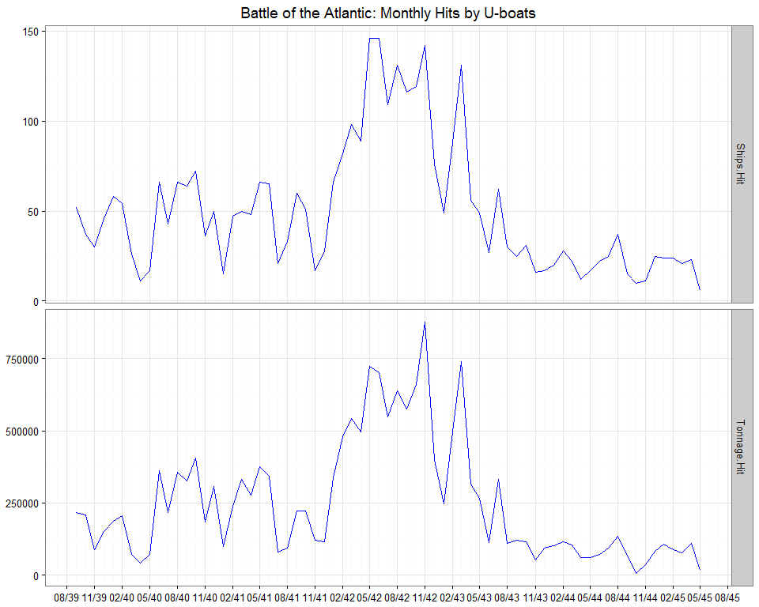\


#### The fate of ships hit by U-boats


```r
loss.by.month.fate <- ship.data %>%
  group_by(year(Date), month(Date), Fate) %>%
  summarise(Ships.Hit = n())

names(loss.by.month.fate) <- c("Year", "Month", "Fate", "Ships.Hit")
loss.by.month.fate$Date <- parse_date_time(paste(loss.by.month.fate$Month,
                                                 loss.by.month.fate$Year), "m*! Y!")

ggplot(data = loss.by.month.fate, aes(x = as.Date(Date), y = Ships.Hit, fill = Fate)) +
  geom_bar(stat = "identity") +
  theme_bw() +
  theme(legend.title = element_blank(), legend.position = "bottom") +
  theme(axis.title = element_blank()) +
  scale_x_date(labels = date_format("%m/%y"), date_breaks = "3 months",
                 date_minor_breaks = "1 month",
                 limits = as.Date(c("1939-09-01", "1945-05-01"))) +
  ggtitle("Battle of the Atlantic: Monthly Hits by U-boats")
```

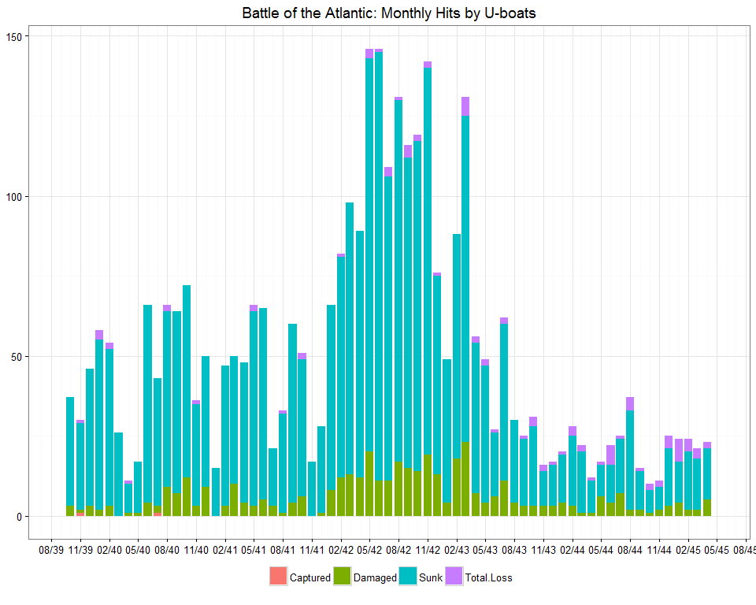\


#### Hits by nation

A summary table of the nations that suffered the most hits.


```r
national.summary <- ship.data %>%
  group_by(Nationality) %>%
  summarise(Ships.Hit = n(),
            Tons.Lost = sum(Tons)) %>%
  arrange(desc(Ships.Hit))

pander(head(national.summary, 20))
```


-------------------------------------
 Nationality   Ships.Hit   Tons.Lost 
------------- ----------- -----------
     UK          1661       9114250  

     USA          549       3310369  

   Norway         314       1474885  

 Netherlands      137       766985   

   Greece         123       538778   

    USSR          106       153568   

   Sweden         89        275983   

   Panama         82        455138   

   Canada         66        204950   

   France         44        159866   

   Belgium        35        202642   

    Egypt         32         29150   

   Brazil         31        121251   

   Denmark        28         63892   

   Finland        24         42692   

 Yugoslavia       15         61703   

   Estonia        12         20907   

  Honduras        11         24651   

   Iceland         9         5851    

  Palestine        9         1504    
-------------------------------------

A function to visualise hits by nation.


```r
national.loss.plotter <- function (nations, ship.labels = "no", data = ship.data, map = atlantic.map) {
  
  # Plots monthly numbers (bar graph) and coordinates (map)
  # of U-boat hits against selected nations
  # Inputs:   nations (character), nations to plot
  #           ship. labels = "no" (character), include labels identifying ships/dates on map (this can
  #             take a long time if there are many data points) 
  #           data = ship.data (data frame), the data set
  #           map = atlantic.map (ggmap), the background map for plotting (ggplot2 will remove rows
  #             from data and produce a warning message if coordinates are beyond the limits of map)
  # Outputs:  p, m (list), the bar graph and map
  
  map.data <- data %>%
    filter(Nationality %in% nations == TRUE,
           is.na(Latitude) == FALSE) %>%
    mutate(Ship.Date = paste0(Ship, ", ", Date))
  
  loss.by.month.nat <- data %>%
    group_by(year(Date), month(Date), Nationality) %>%
    summarise(Ships.Hit = n(),
              Tons.Lost = sum(Tons)) %>%
    filter(Nationality %in% nations == TRUE)
  
  names(loss.by.month.nat) <- c("Year", "Month", "Nationality", "Ships.Hit", "Tons.Lost")
  loss.by.month.nat$Date <- parse_date_time(paste(loss.by.month.nat$Month,
                                                  loss.by.month.nat$Year), "m*! Y!")
  
  p <- ggplot(data = loss.by.month.nat, aes(x = as.Date(Date), y = Ships.Hit, fill = Nationality)) +
    geom_bar(stat = "identity") +
    facet_grid(Nationality ~ .) +
    theme_bw() +
    theme(axis.title = element_blank()) +
    scale_x_date(labels = date_format("%m/%y"), date_breaks = "3 months",
                 date_minor_breaks = "1 month",
                 limits = as.Date(c("1939-09-01", "1945-05-01"))) +
    guides(fill = FALSE) +
    ggtitle("Battle of the Atlantic: Selected Monthly Hits by U-boats")
  
  m <- ggmap(map) +
    geom_point(data = map.data,
               aes(x = Latitude, y = Longitude, size = Tons, colour = Nationality), alpha = 0.5) +
    theme(axis.title = element_blank()) +
    guides(colour = guide_legend(override.aes = list(alpha = 1))) +
    ggtitle("Battle of the Atlantic: Selected Hits by U-boats")
  
  if (ship.labels != "no") {
    
    m <- m + geom_text_repel(data = map.data, aes(Latitude, Longitude, label = Ship.Date),
                             colour = "white", size = 2.7)
    
  }
  
  return(list(p, m))
}
```

Define some maps.


```r
atlantic.map <- get_map(location = c(-100, -10, 10, 75), maptype = "satellite")
med.map <- get_map(location = c(-20, 20, 60, 50), maptype = "satellite")
north.map <- get_map(location = c(-20, 40, 60, 90), maptype = "satellite")
```

Some examples of `national.loss.plotter()`


```r
national.loss.plotter("UK")[[1]]
```

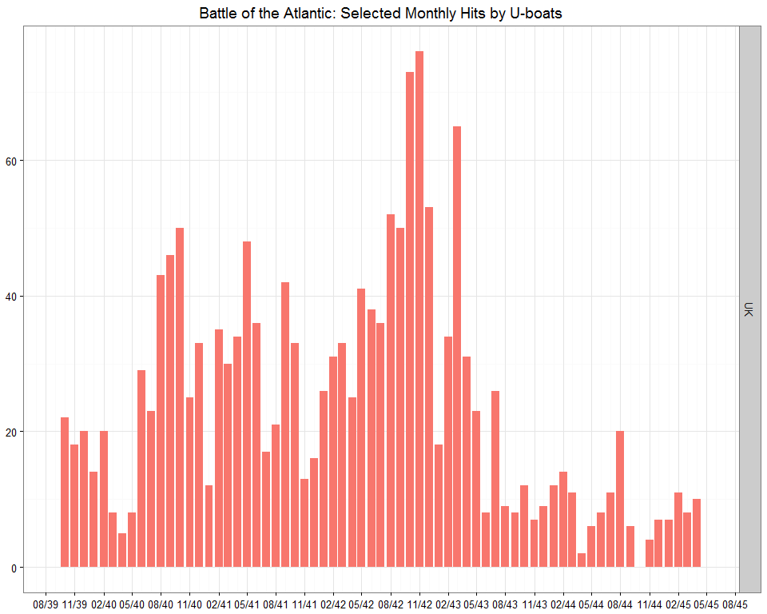\

```r
national.loss.plotter("UK")[[2]]
```

```
## Warning: Removed 186 rows containing missing values (geom_point).
```

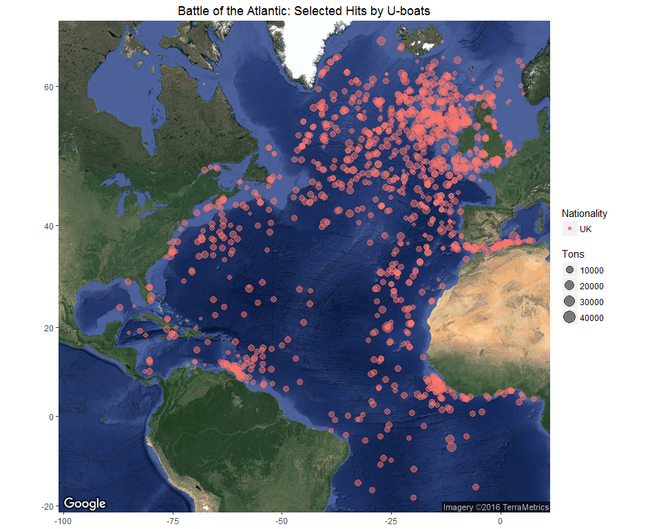\

```r
national.loss.plotter(c("Estonia", "Latvia", "Lithuania"))[[1]]
```

\

```r
national.loss.plotter(c("Estonia", "Latvia", "Lithuania"), ship.labels = "yes")[[2]]
```

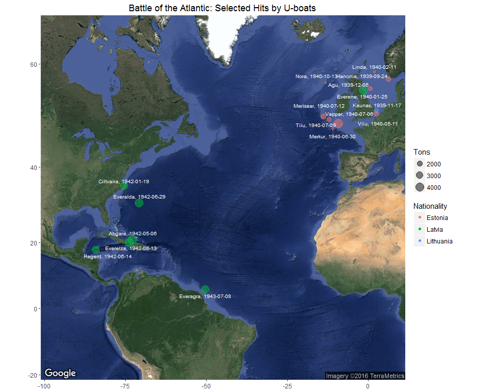\

```r
national.loss.plotter("Palestine", map = med.map)[[2]]
```

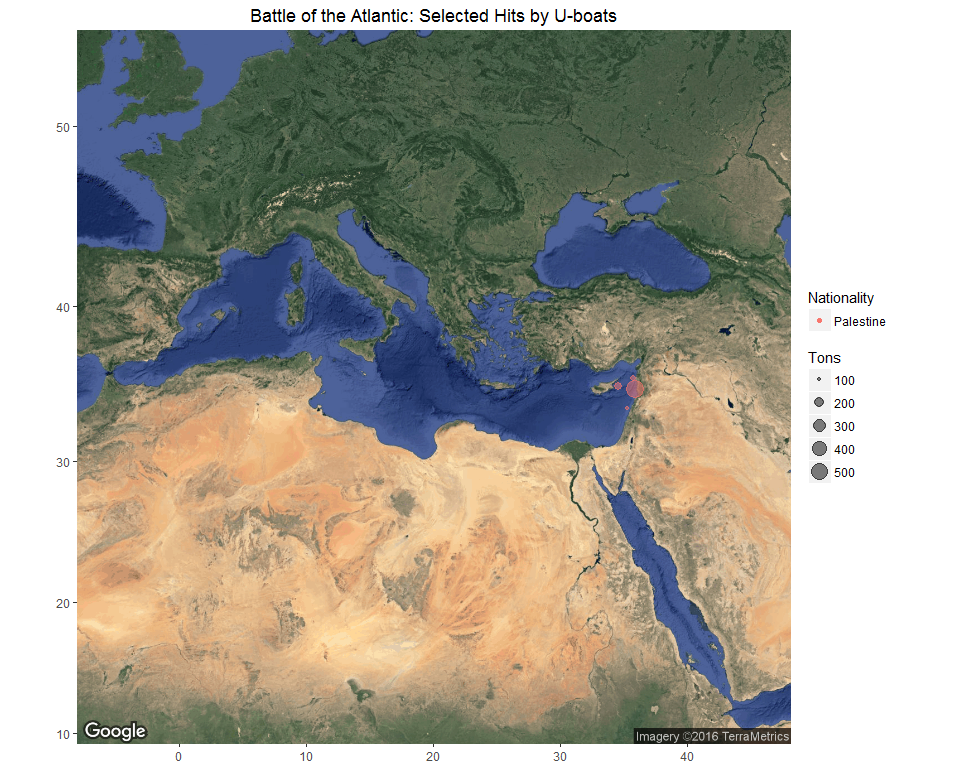\

```r
national.loss.plotter("USSR", map = north.map)[[2]]
```

```
## Warning: Removed 41 rows containing missing values (geom_point).
```

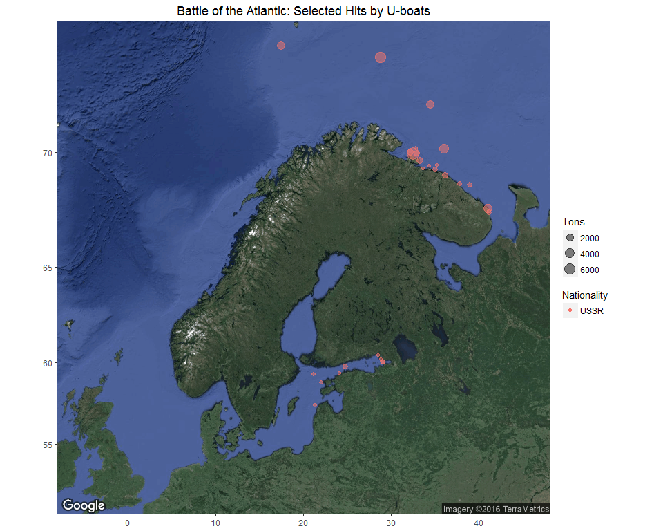\


### The Careers of U-boats and Commanders

Functions to visualise the careers of single boats or commanders.


```r
boat.career.plotter <- function (boat, ship.labels = "no", data = ship.data, map = atlantic.map) {
  
  # Plots ships hit by date (scatter plot) and coordinates (map) by individual U-boat
  # Inputs:   boat (character), U-boats to plot
  #           ship. labels = "no" (character), include labels identifying ships/dates (this can
  #             take a long time if there are many data points) 
  #           data = ship.data (data frame), the data set
  #           map = atlantic.map (ggmap), the background map for plotting (ggplot2 will remove rows 
  #             from data and produce a warning message if coordinates are beyond the limits of map)
  # Outputs:  p, m (list), the scatter plot and map
  
  plot.data <- data %>%
    filter(U.Boat %in% boat == TRUE) %>%
    mutate(Ship.Date = paste0(Ship, ", ", Date))
  
  map.data <- data %>%
    filter(U.Boat %in% boat == TRUE,
           is.na(Latitude) == FALSE) %>%
    mutate(Ship.Date = paste0(Ship, ", ", Date))

  p <- ggplot(data = plot.data,
              aes(x = as.Date(Date), y = U.Boat, colour = Commander, size = Tons)) +
    geom_point(alpha = 0.5) +
    theme_bw() +
    theme(legend.position = "bottom") +
    theme(axis.title = element_blank()) +
    guides(colour = guide_legend(override.aes = list(alpha = 1))) +
    scale_x_date(labels = date_format("%m/%y"), date_breaks = "3 months",
                 date_minor_breaks = "1 month") +
    ggtitle("Battle of the Atlantic: Hits by Selected U-boats")
  
  m <- ggmap(map) +
    geom_point(data = map.data,
               aes(x = Latitude, y = Longitude, size = Tons, colour = U.Boat), alpha = 0.5) +
    theme(axis.title = element_blank()) +
    guides(colour = guide_legend(override.aes = list(alpha = 1))) +
    ggtitle("Battle of the Atlantic: Hits by Selected U-boats")
  
  if (ship.labels != "no") {
    
    p <- p + geom_text_repel(data = plot.data,
                             aes(as.Date(Date), U.Boat, label = Ship.Date),
                             colour = "black", angle = 90, size = 2.5,
                             box.padding = unit(0.4, "lines"), force = 2.5)
    
    m <- m + geom_text_repel(data = map.data, aes(Latitude, Longitude, label = Ship.Date),
                             colour = "white", size = 2.7)
    
  }
  
  return(list(p, m))
  
}

comm.career.plotter <- function (comm, ship.labels = "no", data = ship.data, map = atlantic.map) {
  
  # Plots ships hit by date (scatter plot) and coordinates (map) by individual Commanders
  # Inputs:   boat (character), U-boats to plot
  #           ship. labels = "no" (character), include labels identifying ships/dates (this can
  #             take a long time if there are many data points) 
  #           data = ship.data (data frame), the data set
  #           map = atlantic.map (ggmap), the background map for plotting (ggplot2 will remove rows 
  #             from data and produce a warning message if coordinates are beyond the limits of map)
  # Outputs:  p, m (list), the scatter plot and map
  
  plot.data <- data %>%
    filter(Commander %in% comm == TRUE)%>%
    mutate(Ship.Date = paste0(Ship, ", ", Date))
  
  map.data <- data %>%
    filter(Commander %in% comm == TRUE,
           is.na(Latitude) == FALSE)%>%
    mutate(Ship.Date = paste0(Ship, ", ", Date))

  p <- ggplot(data = plot.data,
              aes(x = as.Date(Date), y = Commander, colour = U.Boat, size = Tons)) +
    geom_point(alpha = 0.5) +
    theme_bw() +
    theme(legend.position = "bottom") +
    theme(axis.title = element_blank()) +
    guides(colour = guide_legend(override.aes = list(alpha = 1))) +
    scale_x_date(labels = date_format("%m/%y"), date_breaks = "3 months",
                 date_minor_breaks = "1 month") +
    ggtitle("Battle of the Atlantic: Hits by Selected Commanders")
  
  m <- ggmap(map) +
    geom_point(data = map.data,
               aes(x = Latitude, y = Longitude, size = Tons, colour = Commander), alpha = 0.5) +
    theme(axis.title = element_blank()) +
    guides(colour = guide_legend(override.aes = list(alpha = 1))) +
    ggtitle("Battle of the Atlantic: Hits by Selected Commanders")
  
  if (ship.labels != "no") {
    
    p <- p + geom_text_repel(data = plot.data,
                             aes(as.Date(Date), Commander, label = Ship.Date),
                             colour = "black", angle = 90, size = 2.5,
                             box.padding = unit(0.4, "lines"), force = 2.5)
    
    m <- m + geom_text_repel(data = map.data, aes(Latitude, Longitude, label = Ship.Date),
                             colour = "white", size = 2.7)
    
  }
  
  return(list(p, m))
  
}
```

Some examples. Labelling the data with the names of ships and dates hit makes use of `ggrepel`. This will take a long time to run if many points are to be labelled, and the results are not fully satisfactory (labels will often overlap). This might be improved by tuning the parameters of `geom_text_repel()`.


```r
boat.career.plotter(c("U-37", "U-552"))[[1]]
```

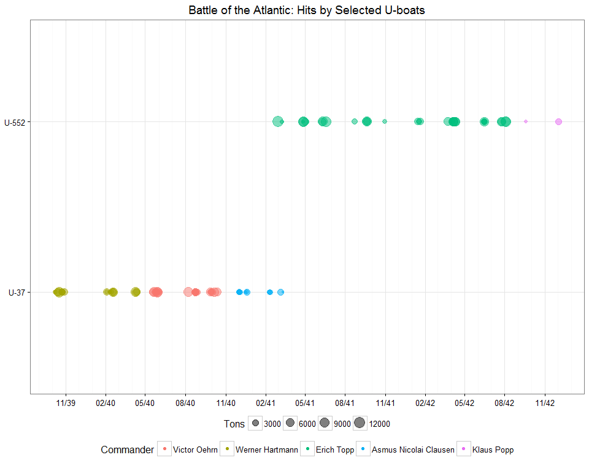\

```r
boat.career.plotter(c("U-31", "U-504"), ship.labels = "yes")[[1]]
```

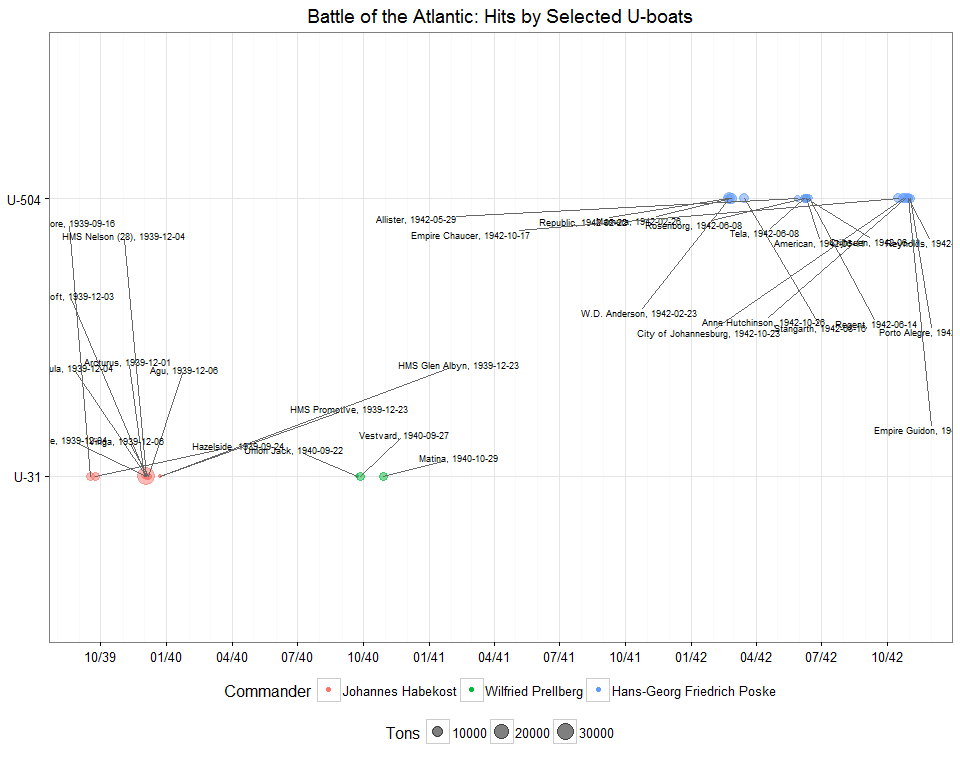\

```r
boat.career.plotter(c("U-37", "U-552"))[[2]]
```

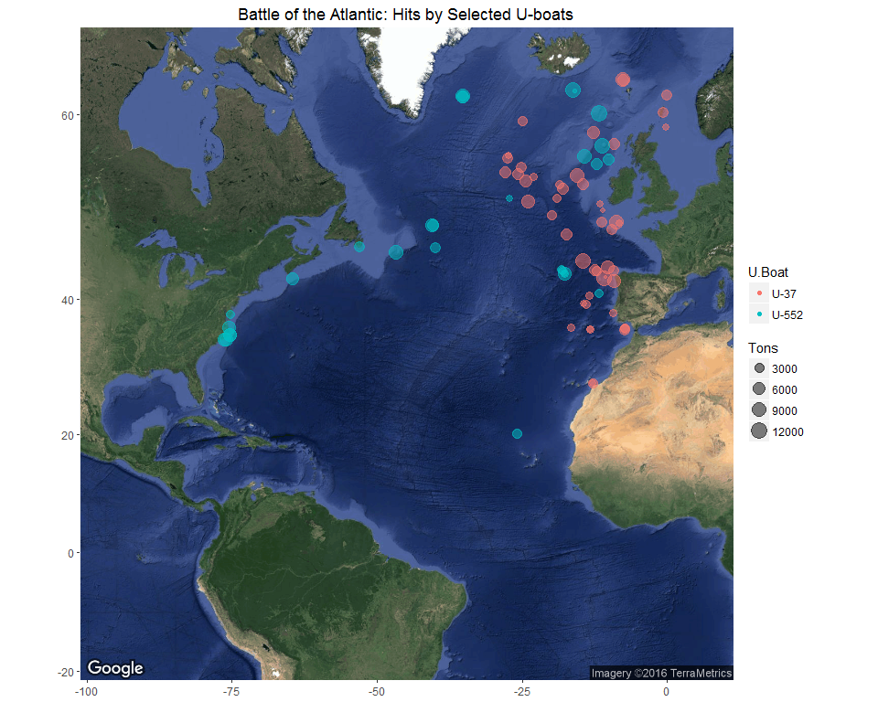\

```r
boat.career.plotter("U-65", ship.labels = "yes")[[2]]
```

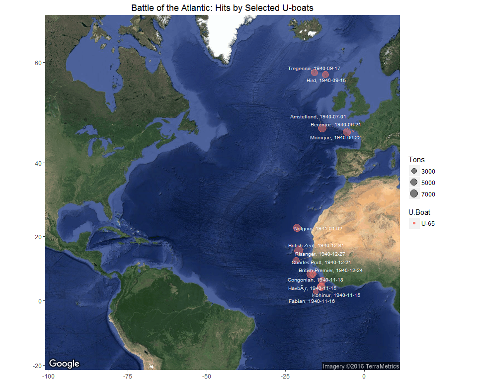\

```r
top.boats <- ship.data %>%
  group_by(U.Boat) %>%
  summarise(Ships.Hit = n()) %>%
  arrange(desc(Ships.Hit)) %>%
  head(5)
pander(top.boats)
```


--------------------
 U.Boat   Ships.Hit 
-------- -----------
  U-37       56     

  U-48       55     

 U-124       52     

 U-123       50     

 U-103       48     
--------------------

```r
boat.career.plotter(top.boats$U.Boat)[[1]]
```

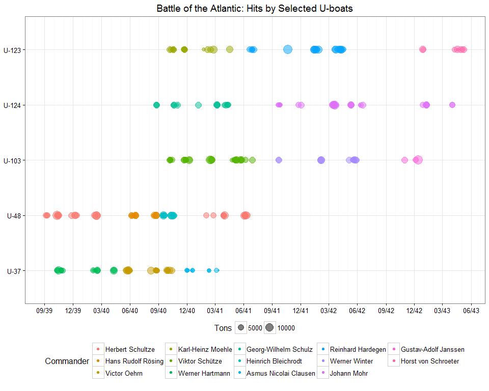\

```r
comm.career.plotter(c("Johann Mohr", "Erich Topp"))[[1]]
```

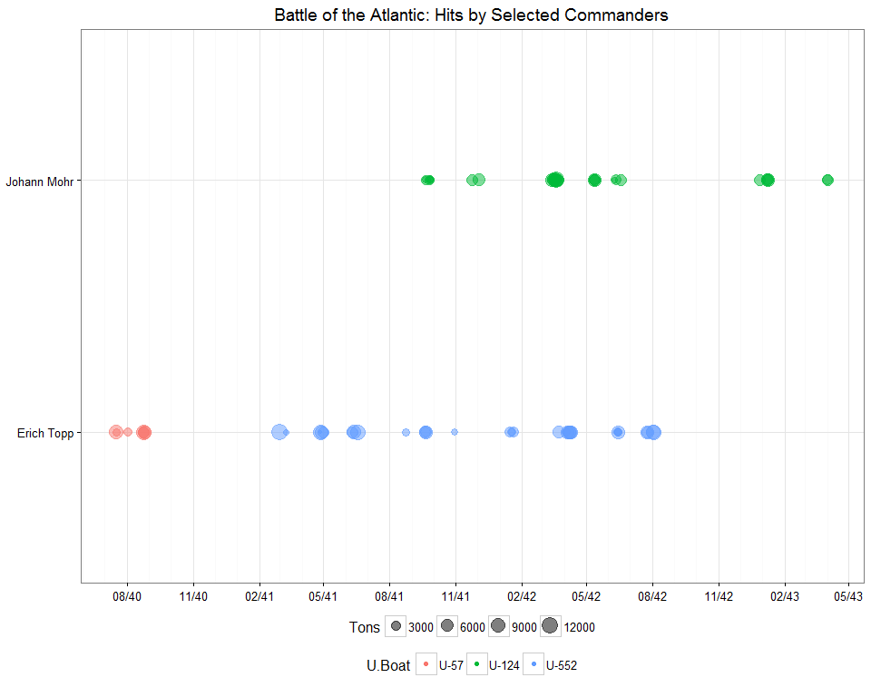\

```r
comm.career.plotter("Johann-Otto Krieg", ship.labels = "yes")[[1]]
```

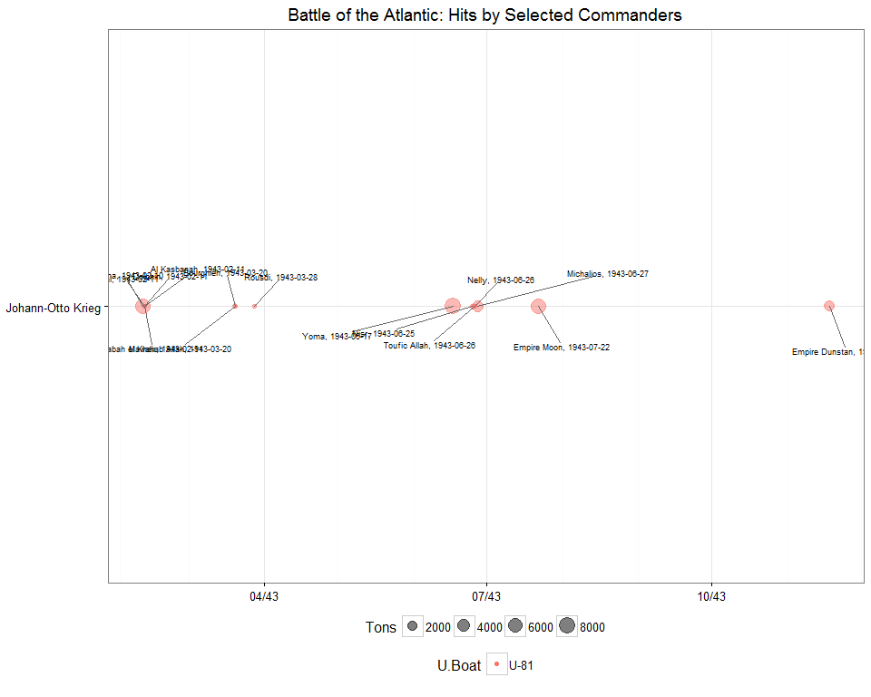\

```r
comm.career.plotter(c("Johann Mohr", "Erich Topp"))[[2]]
```

```
## Warning: Removed 1 rows containing missing values (geom_point).
```

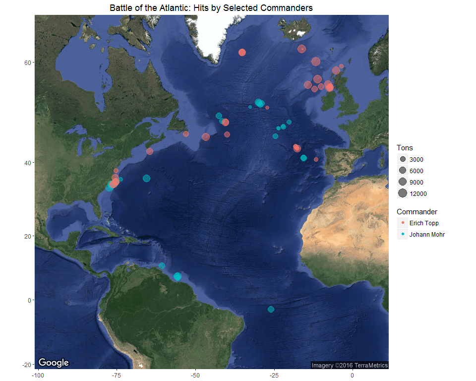\

```r
comm.career.plotter(c("Kurt Baberg", "Friedrich Steinhoff"), ship.labels = "yes")[[2]]
```

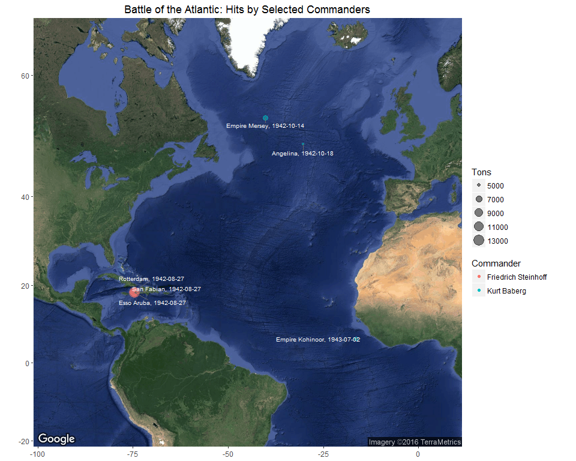\

```r
top.comms <- ship.data %>%
  group_by(Commander) %>%
  summarise(Ships.Hit = n()) %>%
  arrange(desc(Ships.Hit)) %>%
  head(5)
pander(top.comms)
```


---------------------------
   Commander     Ships.Hit 
--------------- -----------
Otto Kretschmer     52     

 Wolfgang Lüth      49     

Joachim Schepke     41     

  Erich Topp        40     

 Günther Prien      39     
---------------------------

```r
comm.career.plotter(top.comms$Commander)[[2]]
```

```
## Warning: Removed 21 rows containing missing values (geom_point).
```

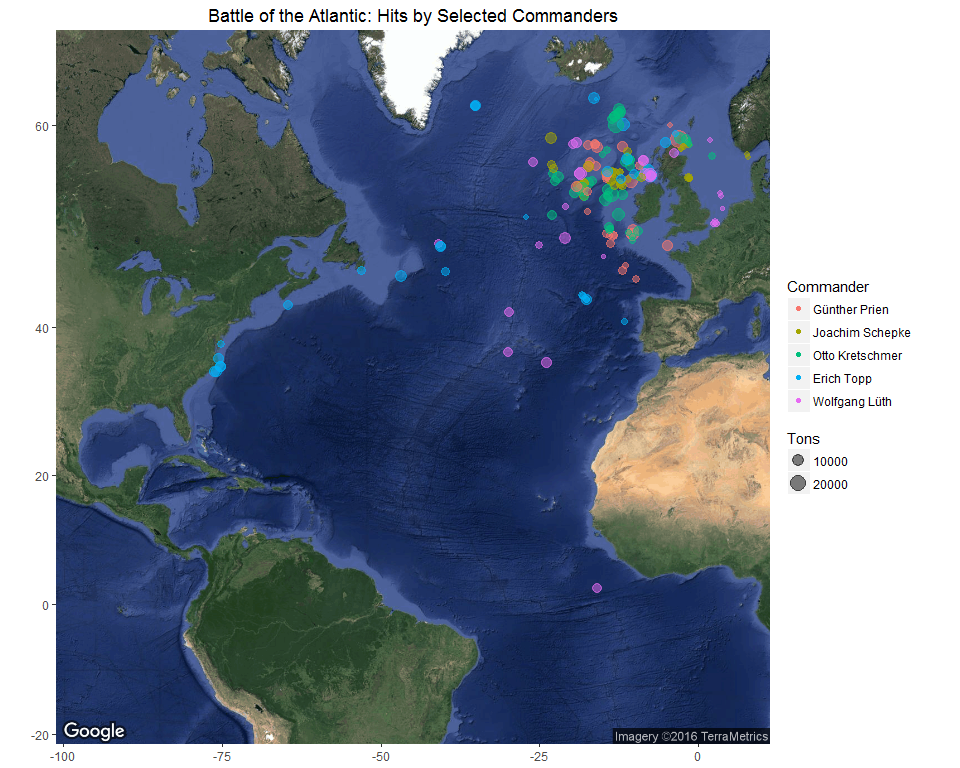\

